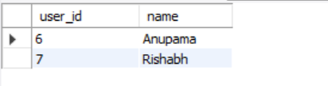
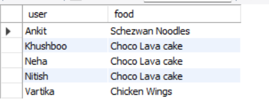
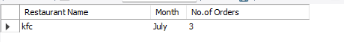
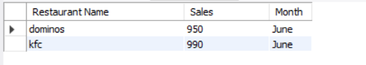
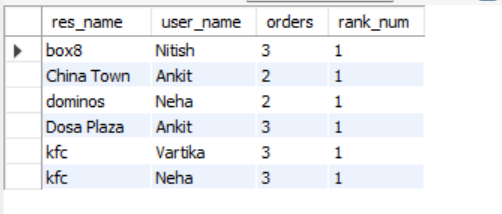
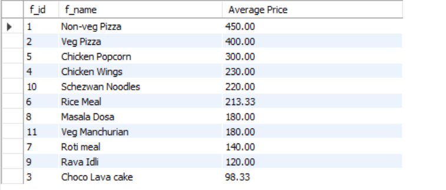
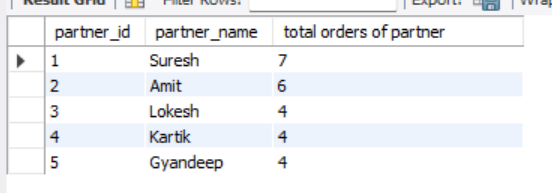

# Data Analysis on Zomato Dataset using MySQL

Tried to understand the customer behaviour and the restaurant engagement of a city on Zomato app/website.
# Overview:

In this analysis, we used a dataset containing 7 different tables which constitute the details of all users, restaurants, orders and delivery partners.

Those 7 tables are: 

1. users : contains user_id, name, email and password of each user.
2. restaurants : contains restaurant id, restaurant name and type of restaurant.
3. menu : contains the details of menu id, restaurant id, food id and food price.
4. food : contains the details of food id, food name and its type.
5. order_details : contains id, order id and food id.
6. orders : contains details like id's of order, restaurant, food, delivery partner id, amount of order, date of order, delivery time, delivery rating and restaurant rating.
7. delivery_partner : contains details of delivery partner id and delivery partner name.

## Customer behavior and Restaurant Engagement

By using MySQL queries and sub queries we extracted data about :

1. User who never ordered:

For implementing this query, used sub-query.

2. Favorite food of a customer

For implementing this query, used Commom table expressions and joins.

3. Top restaurant by total number of orders in a given month

For implementing this query, used stored procedures and joins.

4. Restaurants with monthly sales > x

For implementing this query, used stored procedures and joins.

5. Restaurants with maximum repeated users

For implementing this query, used window functions like rank, Commom table expressions and joins.

6. Average Price per dish

For implementing this query, used Commom table expressions and joins.

7. Total Orders of each delivery partner

For implementing this query, used Commom table expressions and joins.

